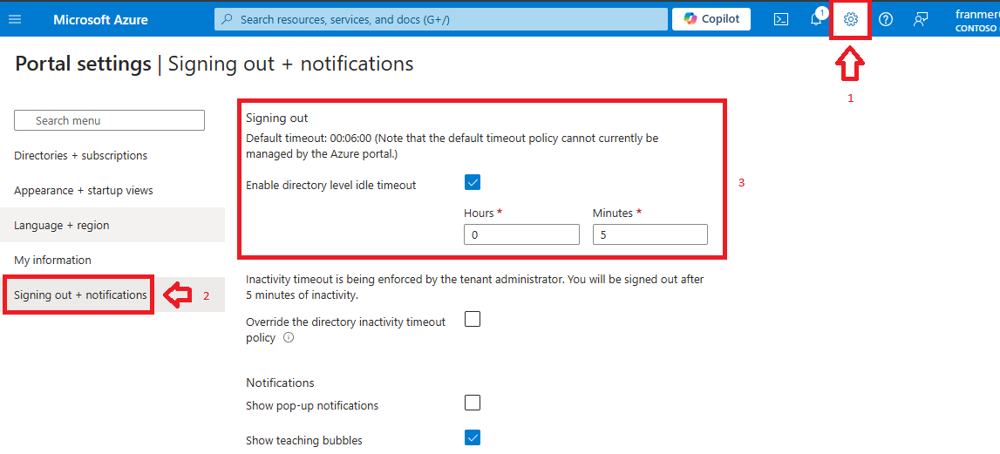
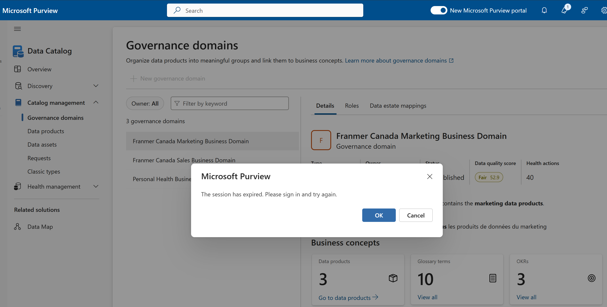
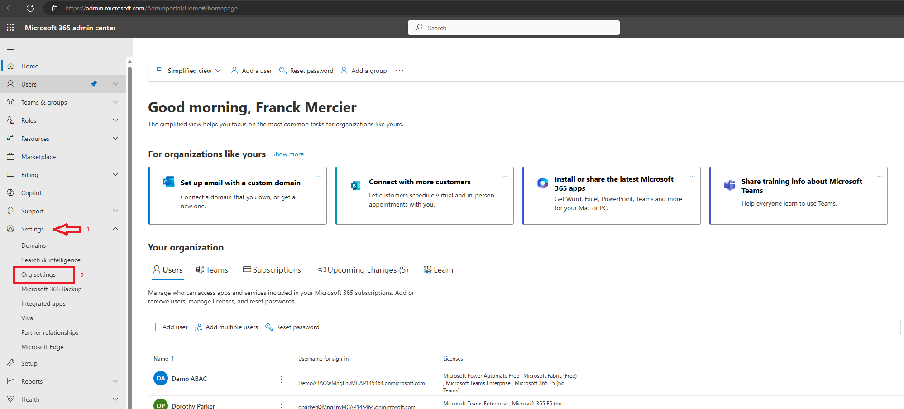
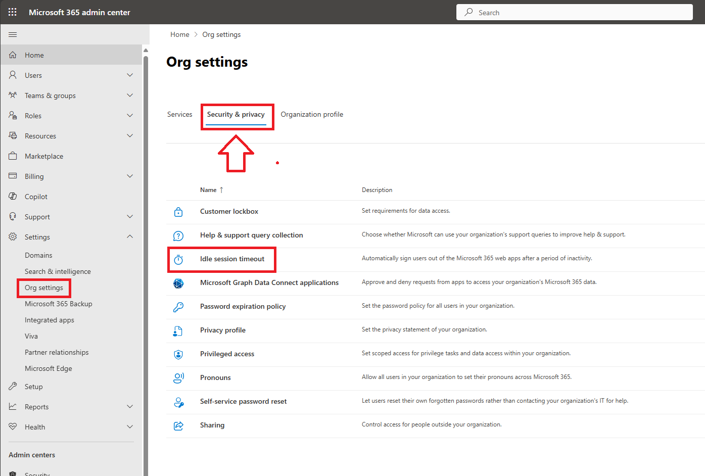
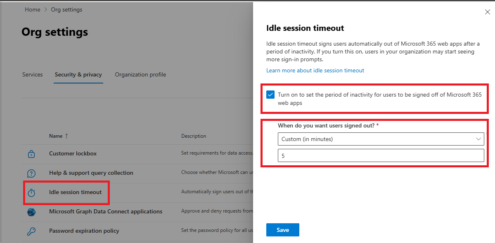
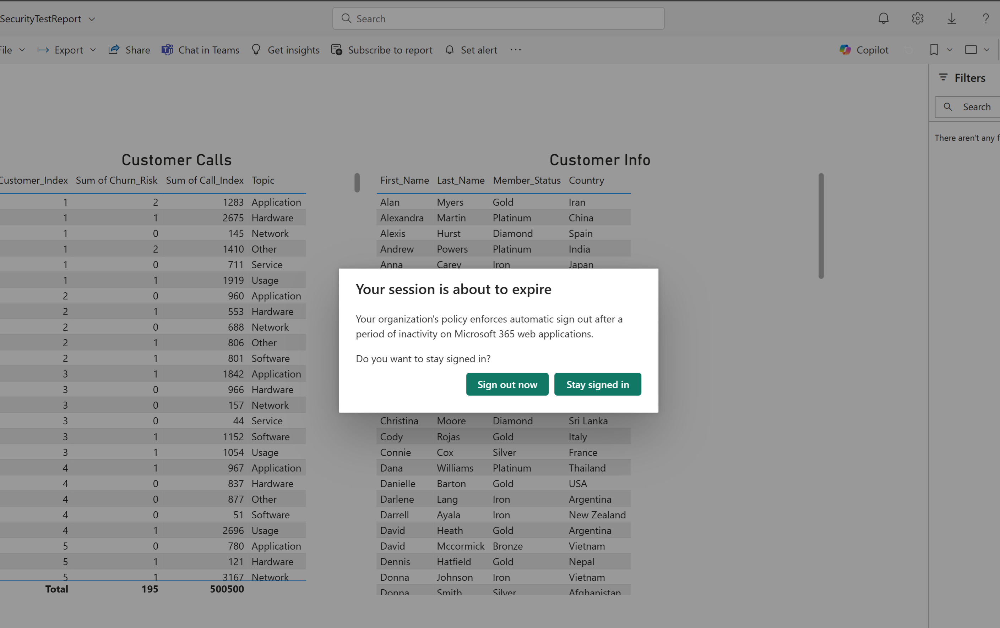

As part of a Microsoft Purview or Microsoft Fabric deployment, you might need to manage the users' session by forcing automatic sign-out after a certain amount of time of inactivity. In this article, I will explain how to start setting up automatic logout for these 2 solutions.

# Microsoft Purview

1. With a **Global Admin** account, sign in to the Azure portal (https://portal.azure.com).
2. Click on the gear in the top right corner of the screen.
3. Click on "**Signing out + notifications**".
4. In the "**Signing out**" section, select the "**Enable directory level idle timeout**" checkbox and set the logout timeout.

Below is a session end of Microsoft Purview:

# Microsoft Fabric

1. Sign in with a **Global admin** account on the Office 365 admin center site. (https://admin.microsoft.com/)
2. In the menus on the left side of the screen, click on "**Settings**", then on "**Org settings**". 

3. At the top of the screen, click on the "**Security & privacy**" tab, then click on "**Idle session timeout**". 

4. In the panel that appears on the right, check the box next to "**Turn on to set the period of inactivity to users to be signed off of Microsoft 365 web apps**". Then set the time before the session ends. 

5. **Warning!!** The setting may take several hours to apply to all of your users 

Below is a session end of Microsoft Fabric:

